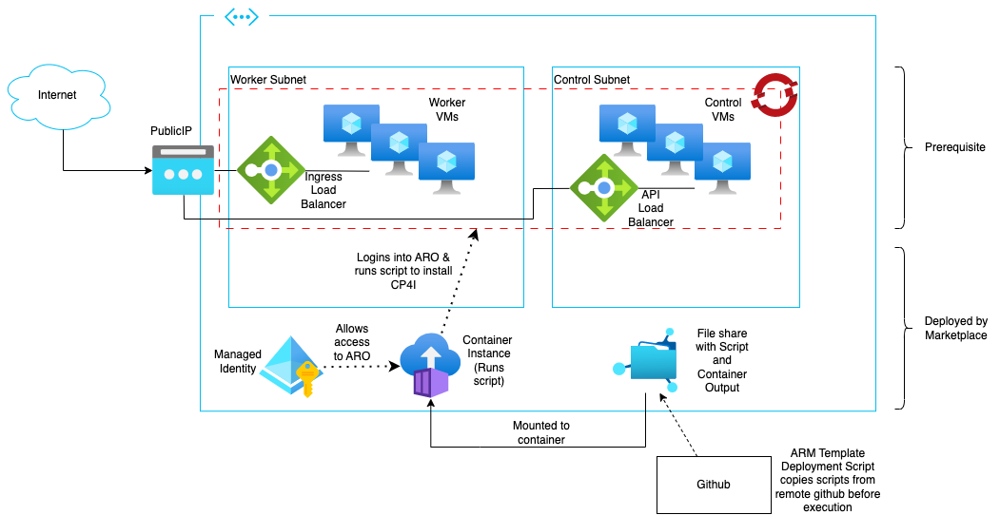
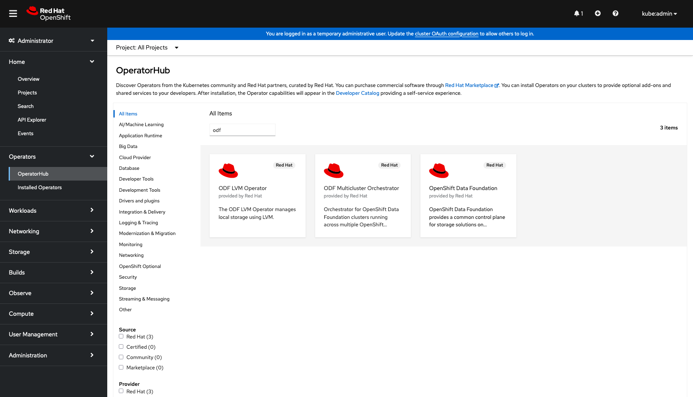
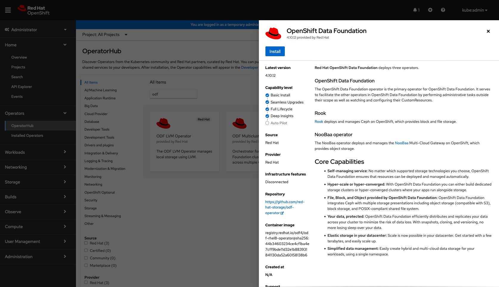
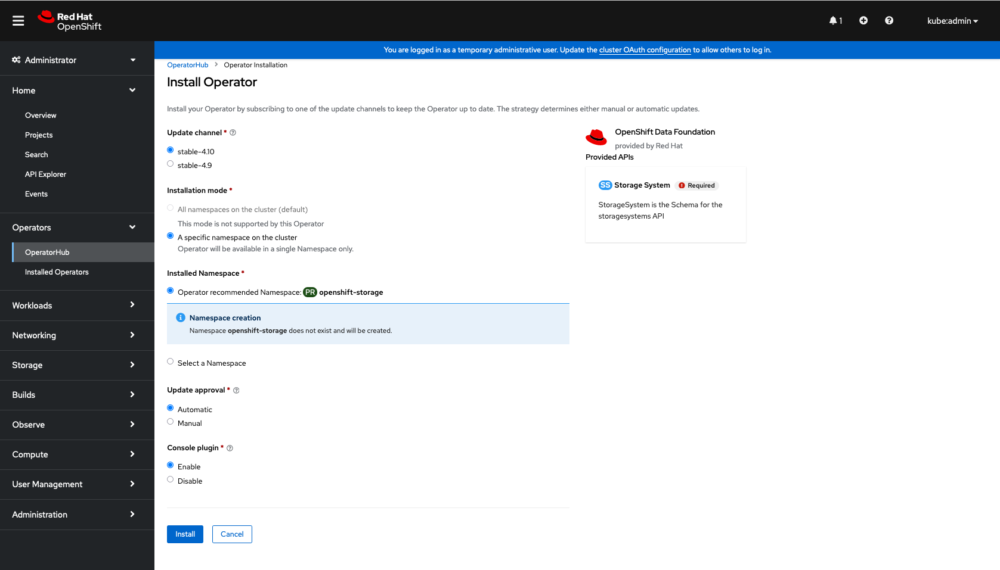
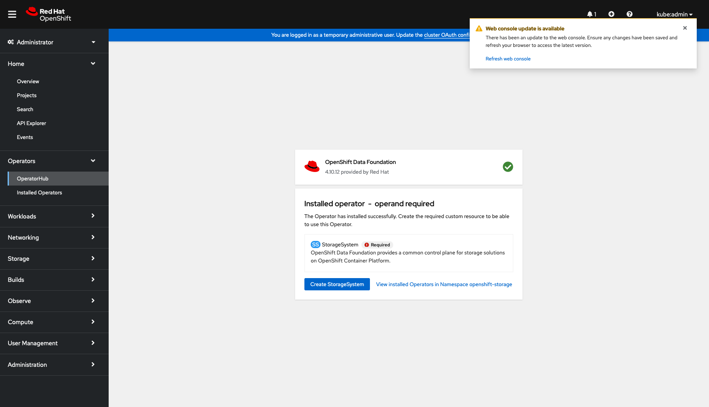
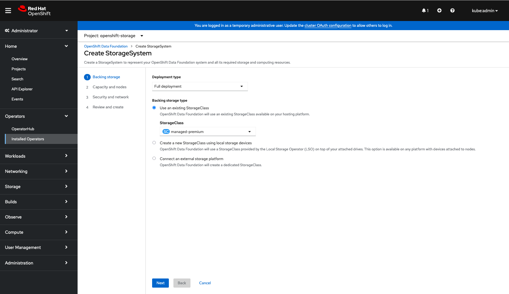
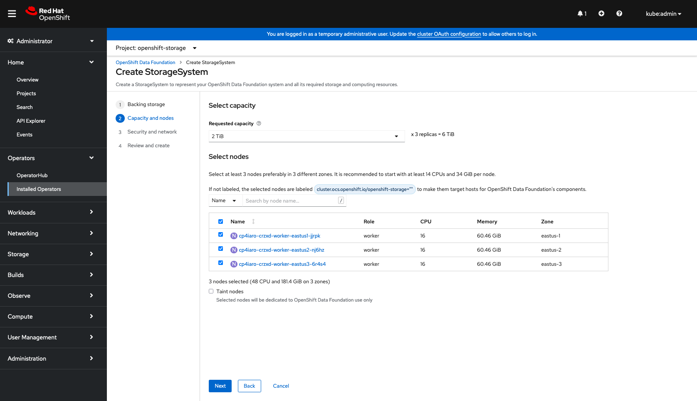
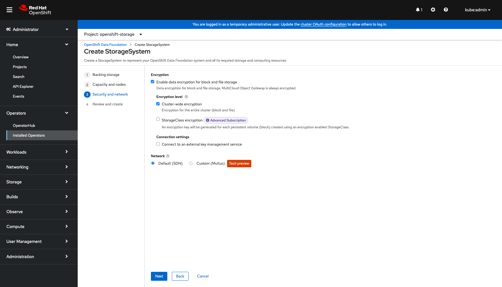
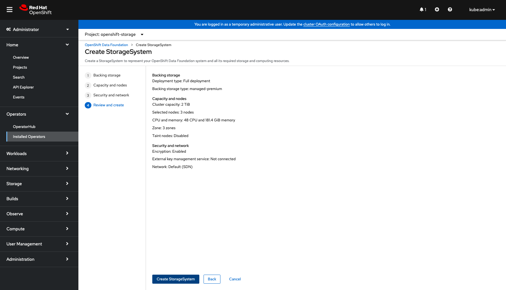
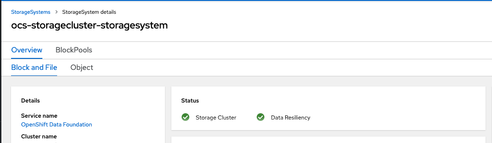

# Create the ARO cluster prerequisite for Cloud Pak for Integration marketplace listing

These instructions will create the minimum required to deploy the Cloud Pak for Integration Azure marketplace listing. 

The Marketplace listing requires an existing Azure Red Hat OpenShift (ARO) cluster with the appropriate storage as a minimum prerequisite before the deployment scripts and supporting resources are deployed by the marketplace listing per the following topology.



Whilst this topology and this guide depict the minimum prerequisites, a more comprehensive one that includes firewalls is recommended for a production deployment. It is recommended to deploy CP4I prior to restricting internet access as the marketplace listing requires access from the internet to the ARO cluster for the installation.

The minimum specifications for the ARO cluster are as follows:
- ARO version 4.10
- A Red Hat Openshift pull secret
- at least 3 nodes (more if you want to deploy multiple Cloud Pak for Integration features)
- a minimum of 16 vCPUs and 64GB RAM per worker node
- OpenShift Data Foundation (ODF/OCS) installed 
- A storage cluster installed with ODF with at least 0.5TB capacity

To install ARO you need to have at least `Application Administrator` access to a subscription and either an existing service principal or `User Access Administrator` access to the subscription and AAD to be able to create a new service principal.

These instructions are a customised subset of those available on the Microsoft site [here](https://learn.microsoft.com/en-us/azure/openshift/tutorial-create-cluster)

1. Obtain a Red Hat OpenShift pull secret

    Refer [here](https://console.redhat.com/openshift/install/pull-secret) to obtain a pull secret.

2. Install the Azure CLI tools

        Refer [here](https://learn.microsoft.com/en-us/cli/azure/install-azure-cli) for instructions on installing the Azure CLI for your workstation.

        You must be using version 2.30.0 or later of the Azure cli. To check the version,
        ```
        az --version
        ```

3. Install jq if not already on your workstation

Refer [here](https://jqlang.github.io/jq/download/) for details on installing the jq cli tool.

4.  Log into your Azure account with the Azure CLI

    ```
    az login
    ```

5. Register the Azure services for the subscription

    If this is the first time using the subscription to create an ARO cluster, it may be necessary to register the required Azure resources for use in the subscription. 

    ***Note that this is only required to be performed once. Subsequent usage does not harm but is unnecessary***

    ```
    az provider register -n Microsoft.RedHatOpenShift --wait
    az provider register -n Microsoft.Compute --wait
    az provider register -n Microsoft.Storage --wait
    az provider register -n Microsoft.Authorization --wait
    az provider register -n Microsoft.Network --wait
    ```

6. Set the base variables to be used later.

    The following values are examples. Change these as needed to your specifications.
    ```
    LOCATION="eastus"
    RESOURCE_GROUP="cp4i-rg"
    CLUSTER_NAME="cp4iaro"
    SUBSCRIPTION_ID=$(az account show --query id -o tsv)
    PULL_SECRET=$(< ~/Downloads/pull-secret)    # Or whatever filename and path it is to your pull secret file
    ```

6. Create a service principal and assign Contributor role

    This step is optional as the ARO cluster creation can create its own service principal, however, there are many situations when it is better to specify a service principal.
    - the ARO created service principal is not deleted when the cluster is deleted
    - the ARO created service principal requires the requesting user to have `User Administrator Access` to the subscription and AAD.

    ***Note that a service principal can only be utilised with a single ARO cluster at a time***

    To create the service principal and record the credentials:

    ```
    az ad sp create-for-rbac --role Contributor --name <service_principal_name> --scopes /subscriptions/$SUBSCRIPTION_ID -o json | tee /tmp/sp-details.json
    CLIENT_ID=$(cat /tmp/sp-details.json | jq -r '.appId')
    CLIENT_SECRET=$(cat /tmp/sp-details.json | jq -r '.password')
    rm /tmp/sp-details.json
    ```

    If you have an existing service principal, set the existing appId and password to the CLIENT_ID and CLIENT_SECRET variables respectively.

7. Create the base infrastructure

    The below example is using standard address spaces and names. You can either use these or specify your own. If you specify your own, note that you will also need to change the names when creating hte ARO cluster later.

    ```
    az group create --name $RESOURCE_GROUP --location $LOCATION
    az network vnet create --resource-group $RESOURCE_GROUP --name vnet --address-prefixes 10.0.0.0/20
    az network vnet subnet create --resource-group $RESOURCE_GROUP --vnet-name vnet --name master-subnet --address-prefixes 10.0.0.0/24
    az network vnet subnet create --resource-group $RESOURCE_GROUP --vnet-name vnet --name worker-subnet --address-prefixes 10.0.1.0/24
    ```

4. Create the ARO cluster

    The version needs to be 4.10. To obtain the list of available ARO versions for the location run:
    ```
    az aro get-versions --location $LOCATION
    ```

    The following example uses `4.10.54` and this should be changed to the latest 4.10 version as displayed in the prior command.

    ```
    az aro create \
        --resource-group $RESOURCE_GROUP \
        --name $CLUSTER_NAME \
        --vnet vnet \
        --master-subnet master-subnet \
        --worker-subnet worker-subnet \
        --version 4.10.54 \
        --pull-secret $PULL_SECRET \
        --master-enc-host true \
        --worker-enc-host true \
        --worker-count 3 \
        --worker-vm-size Standard_D16s_v3 \
        --client-id $CLIENT_ID \
        --client-secret $CLIENT_SECRET \
        --apiserver-visibility Public \
        --ingress-visibility Public
    ```

5. Login to the ARO cluster

    Obtain the console URL with the following command.

    ```
    az aro show -n $CLUSTER_NAME -g $RESOURCE_GROUP --query 'consoleProfile.url'
    ```

    Obtain the cluster login credentials with the following command.

    ```
    az aro list-credentials -n $CLUSTER_NAME -g $RESOURCE_GROUP
    ```

    You can then use the URL and credentials to log into the ARO cluster through a web browser.

6. Create the OpenShift Data Foundation operator and storage subsystem

    1. Once logged into the cluster console as `kubeadmin`, navigate to Operators -> OperatorHub
    
    2. Search for ODF
    
        
    
    3. Install the ODF operator and accept the default values.
    
        
    
        
    
    4. When the operator is installed, create the storage subsystem
        Click on the `Create storage subsystem button`. Ignore the refresh web console request for now.
    
         
    
    5. Select the defaults for the backing storage
    
        

    6. Select all worker nodes or at least 3 nodes with one in each availability zone
    
        

    7. Select `Enable data encryption for block and file storage` and leave the other settings as default
    
        

    8. Create the subsystem
    
        

        You may get a 404 error at this point. Refresh the page with your browser to clear this and load the ODF console page.

7. Wait until the storage subsystem has finished being configured before proceeding.

    The storage subsystem creation will take several minutes. It is ready when the storage subsystem status shows green for `Storage Cluster` and `Data Resiliency` like the below.

    

8. You are now ready to install IBM Cloud Pak for Integration onto your ARO cluster with the Azure marketplace entry.

