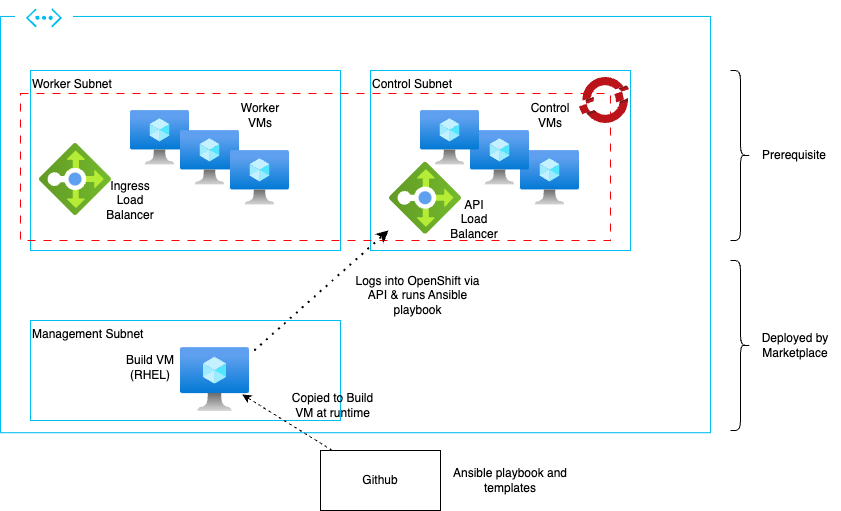

# Create the OpenShift cluster prerequisite for the IBM MQ marketplace listing

These instructions will create the minimum required to deploy the IBM MQ Azure marketplace listing. The marketplace listing deploys the catalogs and operator subscriptions that allow instances/operands to then be installed post the marketplace deployment.

The MQ Marketplace listing requires either an existing [Azure Red Hat OpenShift (ARO)](#azure-red-hat-openshift-aro) cluster or [Self-managed OpenShift](#self-managed-openshift) cluster. The listing will create a new build / management virtual machine (VM). Ideally, this should be in the same virtual network as the OpenShift cluster to avoid possible network issues, however, it can be deployed anywhere providing it has network access to the OpenShift API on port 6443.



Whilst this topology and this guide depict the minimum prerequisites, a more comprehensive one that includes firewalls is recommended for a production deployment. 

## Azure Red Hat OpenShift (ARO)

The minimum specifications for the ARO cluster are as follows:
- ARO version 4.14
- at least 3 nodes
- a minimum of 4 vCPUs and 16GB RAM per worker node (adjust as needed for the instances/operands intended to be installed)

To install ARO you need to have at least `Application Administrator` access to a subscription and either an existing service principal or a suitable role in Azure Entra ID to create one. The service principal can be given `User Access Administrator` and `Contributor` access to the subscription per the below instructions. It is also possible to use non-privileged roles at the resource group scope if needed. Refer [here](https://docs.openshift.com/container-platform/4.14/installing/installing_azure/installing-azure-account.html#minimum-required-permissions-ipi-azure_installing-azure-account) for required service principal permissions.

These instructions are a customised subset of those available on the Microsoft site [here](https://learn.microsoft.com/en-us/azure/openshift/tutorial-create-cluster)

1. Obtain a Red Hat OpenShift pull secret

    Refer [here](https://console.redhat.com/openshift/install/pull-secret) to obtain a pull secret.

2. Install the Azure CLI tools

    Refer [here](https://learn.microsoft.com/en-us/cli/azure/install-azure-cli) for instructions on installing the Azure CLI for your workstation.

    You must be using version 2.62.0 or later of the Azure cli. To check the version,
    ```shell
    az --version
    ```

3. Install jq if not already on your workstation

    Refer [here](https://jqlang.github.io/jq/download/) for details on installing the jq cli tool.

4.  Log into your Azure account with the Azure CLI

    ```shell
    az login
    ```

5. Register the Azure services for the subscription

    If this is the first time using the subscription to create an ARO cluster, it may be necessary to register the required Azure resources for use in the subscription. 

    > Note that this is only required to be performed once. Subsequent usage does not harm but is unnecessary

    ```
    az provider register -n Microsoft.RedHatOpenShift --wait
    az provider register -n Microsoft.Compute --wait
    az provider register -n Microsoft.Storage --wait
    az provider register -n Microsoft.Authorization --wait
    az provider register -n Microsoft.Network --wait
    ```

6. Set the base variables to be used later.

    The following values are examples. ***Change these as needed to your specifications***
    ```shell
    LOCATION="eastus"
    RESOURCE_GROUP="ibmea-rg"
    CLUSTER_NAME="aro-ea"
    SUBSCRIPTION_ID=$(az account show --query id -o tsv)
    PULL_SECRET=$(< ~/Downloads/pull-secret)    # Or whatever filename and path it is to your pull secret file
    ```

6. Create a service principal and assign Contributor role

    This step is optional as the ARO cluster creation can create its own service principal, however, there are many situations when it is better to specify a service principal.
    - the ARO created service principal is not deleted when the cluster is deleted
    - the ARO created service principal requires the requesting user to have `User Administrator Access` to the subscription and AAD.

    > Note that a service principal can only be utilised with a single ARO cluster at a time

    To create the service principal, assign permissions at the subscription level and record the credentials:
    ```shell
    az ad sp create-for-rbac --role Contributor --name <service_principal_name> --scopes /subscriptions/$SUBSCRIPTION_ID -o json | tee /tmp/sp-details.json
    CLIENT_ID=$(cat /tmp/sp-details.json | jq -r '.appId')
    CLIENT_SECRET=$(cat /tmp/sp-details.json | jq -r '.password')
    az role assignment create --assignee "${CLIENT_ID}" --role "User Access Administrator" --scope "/subscriptions/$SUBSCRIPTION_ID"
    rm /tmp/sp-details.json
    ```

    If you have an existing service principal, set the existing appId and password to the CLIENT_ID and CLIENT_SECRET variables respectively.

7. Create the base infrastructure

    The below example is using standard address spaces and names. You can either use these or specify your own. If you specify your own, note that you will also need to change the names when creating hte ARO cluster later.
    ```
    az group create --name $RESOURCE_GROUP --location $LOCATION
    az network vnet create --resource-group $RESOURCE_GROUP --name vnet --address-prefixes 10.0.0.0/20
    az network vnet subnet create --resource-group $RESOURCE_GROUP --vnet-name vnet --name master-subnet --address-prefixes 10.0.0.0/24
    az network vnet subnet create --resource-group $RESOURCE_GROUP --vnet-name vnet --name worker-subnet --address-prefixes 10.0.1.0/24
    ```

8. Create the ARO cluster

    The version needs to be 4.14. To obtain the list of available ARO versions for the location run:
    ```shell
    az aro get-versions --location $LOCATION
    ```

    The following example uses `4.14.16` and this should be changed to the latest 4.14 or later version as displayed in the prior command.

    ```shell
    ARO_VERSION="4.14.16"
    ```

    Select whether the cluster console and applications will be visible from the Internet (`Public`) or only within the virtual network (`Private`). It is best practice to have the API always set to `Private`.
    ```shell
    CONSOLE_VISIBILITY="Private"
    ```

    The below assumes that you are using the [host encryption](https://learn.microsoft.com/en-us/azure/virtual-machines/disks-enable-host-based-encryption-portal?tabs=azure-powershell) feature which needs to be enabled for the subscription. Remove the `--master-enc-host` and `--worker-enc-host` options if not using these.
    ```shell
    az aro create \
        --resource-group $RESOURCE_GROUP \
        --name $CLUSTER_NAME \
        --vnet vnet \
        --master-subnet master-subnet \
        --worker-subnet worker-subnet \
        --version $ARO_VERSION \
        --pull-secret $PULL_SECRET \
        --master-enc-host true \
        --worker-enc-host true \
        --worker-count 3 \
        --worker-vm-size Standard_D4s_v3 \
        --client-id $CLIENT_ID \
        --client-secret $CLIENT_SECRET \
        --apiserver-visibility Private \
        --ingress-visibility $CONSOLE_VISIBILITY
    ```

9. Login to the ARO cluster

    Obtain the console URL with the following command.

    ```shell
    az aro show -n $CLUSTER_NAME -g $RESOURCE_GROUP --query 'consoleProfile.url'
    ```

    Obtain the cluster login credentials with the following command.

    ```shell
    az aro list-credentials -n $CLUSTER_NAME -g $RESOURCE_GROUP
    ```

    You can then use the URL and credentials to log into the ARO cluster through a web browser.

10. You are now ready to install IBM MQ onto your ARO cluster with the Azure marketplace entry.

## Self-managed OpenShift

As an alternative to a managed Azure Red Hat OpenShift deployment, it is possible to deploy a self-managed OpenShift cluster. 

The minimum specifications for the OpenShift cluster are as follows:
- OpenShift version 4.14 or higher
- at least 3 nodes
- a minimum of 4 vCPUs and 16GB RAM per worker node (adjust as needed for the instances/operands intended to be installed)

As with an ARO cluster, a service principal is required to enable the cluster to manage the Azure resources. The service principal can be given `User Access Administrator` and `Contributor` access to the subscription per the below instructions. It is also possible to use non-privileged roles at the resource group scope if needed. Refer [here](https://docs.openshift.com/container-platform/4.14/installing/installing_azure/installing-azure-account.html#minimum-required-permissions-ipi-azure_installing-azure-account) for required service principal permissions.

1. Ensure the required Azure account prerequisites are met

    Before proceeding, ensure you have sufficient access to the intended Azure subscription, a public DNS zone exists (if the cluster is to have internet access) and the Azure account limits are sufficient for the cluster. Refer [here](https://docs.openshift.com/container-platform/4.14/installing/installing_azure/installing-azure-account.html) for details.

1. Obtain a Red Hat OpenShift pull secret

    Refer [here](https://console.redhat.com/openshift/install/pull-secret) to obtain a pull secret.

2. Obtain the OpenShift installer.

    Go to the Infrastructure Provider Red Hat page [here](https://console.redhat.com/openshift/install), scroll down to `Run it yourself` and select the appropriate Azure option for your workstation's architecture. Once downloaded to your workstation, unpack the installer to your workspace (adjust the path and filename to the file you just downloaded).

    ```shell
    tar xvzf .openshift-install-mac-arm64.tar.gz
    ```

3. Create a service principal and assign Contributor role

    This step uses the AZ CLI to create a new service principal and assign it permissions. It can also be done through the Azure portal. Refer [here](https://docs.microsoft.com/en-us/cli/azure/install-azure-cli-yum?view=azure-cli-latest) to install the Azure CLI if it is not presen on your workstation.

    Log into the Azure CLI.
    ```shell
    az login
    ```

    Obtain the subscription id and tenant id. Note that if the intended subscription is not the active one, select the appropriate one for the OpenShift cluster deployment and manually set the `SUBSCRIPTION_ID` variable.
    ```shell
    echo "Subscription id = $(az account show --query id)"
    echo "Tenant id       = $(az account show --query tenantId)"
    SUBSCRIPTION_ID="$(az account show --query id -o tsv)"
    ```
    Take a note of the subscription id and tenant id as these will be required later when creating the cluster.

    To create the service principal, assign permissions at the subscription level and record the credentials:
    ```shell
    az ad sp create-for-rbac --role Contributor --name <service_principal_name> --scopes /subscriptions/$SUBSCRIPTION_ID -o json | tee /tmp/sp-details.json
    CLIENT_ID="$(cat /tmp/sp-details.json | jq -r '.appId')"
    az role assignment create --assignee "${CLIENT_ID}" --role "User Access Administrator" --scope "/subscriptions/$SUBSCRIPTION_ID"
    echo "Client id     = $(cat /tmp/sp-details.json | jq -r '.appId')"
    echo "Client secret = $(cat /tmp/sp-details.json | jq -r '.password')"
    rm /tmp/sp-details.json
    ```

    > Take note and securely store the client id and client secret values. They will be required later to create the cluster.

4. Create an SSH key-pair (optional)

    If you already have an SSH key pair that you intend to use, then you can skip this step. Otherwise, create a new key-pair as follows. Adjust the filename and path `~/.ssh/id_rsa` as necessary.

    ```shell
    ssh-keygen -t ed25519 -N '' -f ~/.ssh/id_rsa
    ```

5. Add the SSH private key identity to the SSH agent (optional)

    If not already done, add the SSH private key identity to the SSH agent to enable passwordless SSH authentication to the cluster's nodes or to use the `openshift-install gather` command to gather logs.

    First, ensure the ssh-agent process is running.
    ```shell
    eval "$(ssh-agent -s)
    ```

    Then add the key to the agent. As with the earlier command, adjust the filename and path to suit.
    ```shell
    ssh-add ~/.ssh/id_rsa
    ```

4. Create the cluster

    This approach is the easiest and simpliest, however, you may wish to customize the cluster, including making it a private cluster. Refer [here](https://docs.openshift.com/container-platform/4.14/installing/installing_azure/installing-azure-customizations.html) to customize the cluster.

    To create a basic OpenShift cluster run the following from your install workspace on your workstation.
    ```shell
    ./openshift-install create cluster --dir ./ --log-level=debug
    ```

    Provide the following values when prompted from the value recorded in the earlier steps.
    - azure subscription id
    - azure tenant id
    - azure service principal client id
    - azure service principal client secret

    Then, select the Azure region to deploy into, the base domain (the Azure DNS zone), a name for the cluster and paste the pull secret downloaded earlier when prompted.

    At the end of the cluster creation, the installer will output the console URL and login credentials. If you wish to login locally using the `oc` OpenShift CLI, use the kube config file created during the cluster creation as follows from the installation workspace.
    ```shell
    export KUBECONFIG="$(pwd)/auth/kubeconfig"
    ```

    You can then use the `oc` command to access the OpenShift cluster API.

5. You are now ready to use the IBM MQ marketplace listing.
