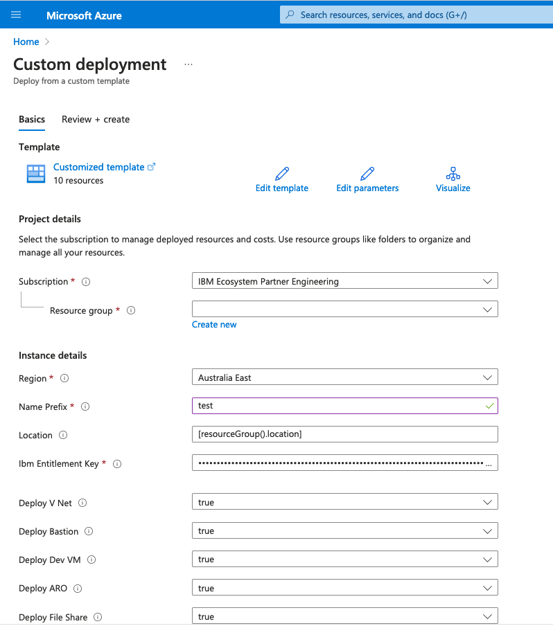

# IBM Sterling Order Management System on Azure

[](https://portal.azure.com/#create/Microsoft.Template/uri/https%3A%2F%2Fraw.githubusercontent.com%2FIBM%2Fazure-marketplace-arm-templates%2Fmain%2Fsterling-oms%2FmainTemplate.json)
[](http://armviz.io/#/?load=https%3A%2F%2Fraw.githubusercontent.com%2FIBM%2Fazure-marketplace-arm-templates%2Fmain%2Fsterling-oms%2FmainTemplate.json)

## Deployment Topology

This template will deploy a IBM Sterling OMS onto Azure Red Hat OpenShift (ARO) with a PostgreSQL Flexible server and Azure file storage. The Sterling software will be installed onto the ARO cluster and the following instances will be instantiated with the PostgreSQL server as the backend database:
- Sterling frontend
- OrderHub Base
- OrderHub Extension
- Health Monitor

To use Order Service, please integrate the instance with an a message queue.

The following Azure topology is deployed:


## Prerequisites

- Have an Azure subscription
- The subscription should have at least the following services resource providers registered:
    - Microsoft.Networks
    - Microsoft.Compute
    - Microsoft.Storage
    - Microsoft.RedHatOpenShift
    - Microsoft.Authorization
    - Microsoft.DBforPostgreSQL
    - Microsoft.OperationalInsights
    - Microsoft.Insights
    - Microsoft.ContainerRegistry
- A Red Hat OpenShift pull secret
   Refer [here](https://console.redhat.com/openshift/install/pull-secret) to obtain a pull secret. Save this pull secret to a file on your local machine.
- An IBM API Entitlement Key. This is required to download the IBM software binaries.

## Instructions - Azure Portal

1. Create a service principal in the Azure Active Directory
2. Click on the Deploy to Azure button above
3. Log into your Azure account if not already logged in
4. Fill in the parameters according to your requirements



- Choose the right subscription
- Create a new resource group or specify an existing one
- Specify the region into which to deploy resources
- Enter your IBM API Entitlement Key
- Leave deploy VNet, ARO and Fileshare as true to deploy OMS
- Select whether to depoy the Bastion or Dev VM (bastion required for Dev VM access)


- Leave Deploy ACR, Log Analytics, Postgres and Sterling as true to deploy OMS
- Accept the IBM Sterling license terms (refer to IBM for details)
- Leave the VNet name as is or change to a custom name
- Leave the NGW name as is or change to a custom name
- Leave the CIDR's as they are to use the defaults or modify as necessary, ensure there are no overlapping subnets
- Leave the admin user for for Dev VM as is, or change
- Enter an admin password. This will be utilized for several components including the Dev VM and database
- For the SP Client Id, enter the app id of the service principal created earlier
- For the SP Client Secret, enter the password for the service principal created earlier
- For the SP Object Id, enter the object id fo the service principal created earlier
- For the RP Object IDd, enter the Red Hat openshift resource provider object id.
    This can be obtained by running:
    ```shell
    az ad sp list --display-name "Azure Red Hat OpenShift RP" --query "[0].id" -o tsv
    ```


- Enter the Red Hat Pull Secret
- Leave as is, or change the worker size
- Leave as is, or change the quantity of worker nodes
- Modify the namespace / project if necessary
- Leave the other fields as they are unless you are changing the code

5. Click on `Review + Create`

Once the validation is completed, you should be presented with a screen like the following,


At this point, click `Create` to commence the deployment.

## Post deployment

### Console Access

To access the console, find the deployed ARO cluster by entering the following,
```shell
az aro list -o table
```

Then obtain the credentials for this cluster with the following,
```shell
az aro list-credentials -n cluster_name -g resource_group
```

### Call Center

The Sterling OMS Call Center can be accessed from
- the URL in the marketplace deployment output
- in the ARO cluster, by navigating to Networking - Routes and locating the Call Center route
- by constructing it from as "https://smcfs-***omsNamespace***.apps.***aroDomain***.***aroLocation***.aroapp.io/call-center" for example, "https://smcfs-oms.apps.mydomain.eastus.aroapp.io/call-center"

### Order Management Hub

The Sterling OMS Order Management hub can be accessed from
- the URL in the marketplace deployment output
- in the ARO cluster, by navigating to Networking - Routes and locating the Order Management  route
- by constructing it from as "https://smcfs-***omsNamespace***.apps.***aroDomain***.***aroLocation***.aroapp.io/order-management" for example, "https://smcfs-oms.apps.mydomain.eastus.aroapp.io/order-management"

### Database Access

Once OMS is deployed, you can check the status of the database by connecting to it and listing the created tables in the schema as follows.

1. Navigate to the PSQL pod installed on the cluster.
    1. Go to workloads -> pods
    2. Select the namespace specified in the automation (e.g. oms) from the pull list of projects at the top
    3. Open the pod named `psql-client` (note this may have been changed if specified by an override during the installation)
    4. Choose `terminal` then enter the following. The variables are set as environment variables for the pod.

        ```shell
        psql -d "host=$PSQL_HOST port=5432 dbname=$DB_NAME user=$PSQL_ADMIN password=$PSQL_PASSWORD sslmode=require"

        => \dt <schema_name>.*
        ```

    where <schema_name> is the name of the schema you previously created.

    For example,
        `\dt oms.yfs*`

    To list all databases, `\l oms.*`

    Check the logs in the `<instance_name>-data-manager-xxxx` pod. This pod is used to create the database structure in postgres. 

