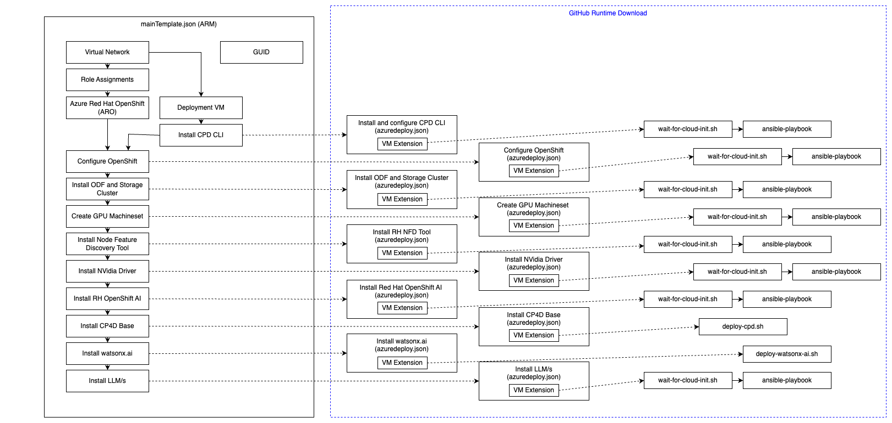

# Azure Resource Manager (ARM) Template for watsonx.ai

## Table of Contents

- [Azure Resource Manager Template for watsonx.ai](#azure-resource-manager-arm-template-for-watsonxai)
    - [Table of Contents](#table-of-contents)
    - [Overview](#overview)
    - [Key Components](#key-components)
    - [Prerequisites](#prerequisites)
    - [Troubleshooting](#troubleshooting)
        - [OpenShift failed](#openshift-failed)
        - [ODF &/or storage cluster failed](#odf-andor-storage-cluster-failed)
        - [GPU Machineset failed](#gpu-machineset-failed)
        - [Foundation model failed](#foundation-llm-model-failed)
    - [References](#references)
    - [Open Source @ IBM](#open-source--ibm)
    - [License](#license)

## Overview

This sub-directory contains an Azure Resource Manager (ARM) Template and associated files that deploys an Azure Red Hat OpenShift (ARO) cluster with watsonx.ai and foundation models deployed.

The `mainTemplate.json` is run against the Azure Resource Manager (ARM). It downloads the deployment templates from github at runtime and then executes these `azuredeploy.json` templates against the Azure Resource Manager. The VM extension runs a custom script on the targetted virtual machine (VM) which downloads the specified files and executes them on the virtual machine. Only one custom script is permitted to execute at one time on the same VM. In addition, only a single custom script is supported at one time on the same VM. It is not possible to have multiple custom-scripts on a single VM. As such, the VM extension based deployment is dependent upon the prior deployment to complete before being executed and each extension has the same extension name. In this manor, each additional VM extension replaces the prior one. Note that there is a 90 minute timeout built into the custom script VM extension.

## Key Components:
- Virtual Network (new or existing)
- Azure Red Hat OpenShift with ingress and/or API public or private together with the ability to deploy different sized nodes. Role assignments provide ARO access to control the Azure infrastructure including virtual network.
- Deployment VM which executes the VM extensions to build the watsonx.ai environment on OpenShift. The deployment VM is also provided with a managed Id which provides it access to the resources in the resource group. Post deployment, it provides a convenient management server for the OpenShift cluster.
- Configure VM. This deployment runs a VM extension on the deployment VM that installs the cpd-cli onto the deployment virtual machine together with the Azure CLI, az, and other tools.
- Configure OpenShift. A deployment that runs a VM extension on the deployment VM to configure the ARO cluster for watsonx.ai. This includes configuring sysctl, adjusting security limits, configuring crio and configuring the kubelet for each worker node.
- Install ODF and storage cluster. A deployment that runs a VM extension on the deployment VM that installs the OpenShift Data Foundation (ODF) operands, patches the console for the ODF dashboard and creates a storage cluster. If existing nodes are selected, then existing nodes are labelled for the storage cluster, otherwise, a new set of machinesets is created to host the storage cluster with default node sizes and one node per availability zone.
- Create the GPU machineset. A deployment that runs a VM extension on the deployment VM to create a new machineset for the GPU node or nodes. At the time of publishing, Azure did not have versions of each type of GPU node in every availability zone in any particular Azure region. Either supply the zone to the `mainTemplate.json` or set to `0` (zero), default, to allow the extension to determine the zone in the specified region for the GPU node.
- Install the Red Hat Node Feature Discovery (NFD) Tool. A deployment that runs a VM extension on the deployment VM to install the Red Hat Node Feature Discovery Tool operator and operand. This tool queries the hardware features of each node and adds labels accordingly. For node with GPU's installed, the tool adds labels to indicate that the node has a GPU installed. This label is then used to schedule workloads that require GPUs.
- Install Nvidia driver. A deployment that runs a VM extension on the deployment VM to install the Nvidia driver operator and operand. The Nvidia operand must be successfully deployed prior to running any other GPU related workloads.
- Install Red Hat OpenShift AI. A deployment that runs a VM extension on the deployment VM to install the Red Hat OpenShift AI and Service Mesh operators and operands. Service Mesh is a prerequisite for Red Hat OpenShift AI 2.8 is service mesh. OpenShift AI 2.8 is required for watsonx.ai 5.0.3 and higher.
- Install the IBM Cloud for Data foundation. A deployment that runs a VM extension on the deployment VM to install the base operands and operators for the IBM Cloud Pak. 
- Install watsonx.ai. A deployment that runs a VM extension on the deployment VM to install the watsonx.ai custom resource operators and operands. 
- Install foundation models. A deployment that runs a VM extension on the deployment VM to patch the watsonx.ai operand with the foundation model requirements. The watsonx.ai operand reconciliation then installs the foundation model or models and runs the inference engine for each model on the required GPU shard or shards. If there are insufficent GPU shards available, the POD will remain in pending scheduling state and the deployment will timeout. Review the ARO console for the status of the pods.

## Prerequisites

- Red Hat OpenShift pull secret. Refer [here](https://console.redhat.com/openshift/install/pull-secret) for details.
- IBM entitlement API key for watsonx.ai
- An Azure subscription
- A resource group in the Azure subscription with contributor and user access administrator roles available to the requesting user
- An Azure service principal with contributor and user access administrator role permissions for the resource group. Check the references section for the minimum permissions required to deploy and run ARO.
- The subscription or resource group must not limit internet access. Internet access is required to be able to download the components of this deployment.
- The ARO resource provider object Id for the Azure tenant
- Sufficient Azure quota in the Azure subscription for the ARO cluster and GPU nodes

## Troubleshooting

Below guidance may provide assistance in locating the problem in the event of a deployment failure. In general, if the deployment fails, check the deployment details in the Azure portal first. This may require going into the deployment by clicking on it for more details for the VM extension deployments and then getting the failure details. 

### OpenShift failed

A common error with an ARO deployment is an "Internal Server Error". Check the failed deployment details in the Azure portal. If this happens, delete the resource group and try the deployment again.

Another common failure reason for an ARO deployment is the service principal or user permissions. Check that the service principal and user have the minimum required permissions.

### ODF and/or storage cluster failed

There are a few reasons the storage cluster and/or ODF operand may fail. Check the deployment details for the Ansible output which may help to pin point the reason. Following are possible causes and their fixes.

| Fault  | Rectification Action           |
|-----------|-------------------------------------------------------------|
| Insufficient worker nodes or insufficient capacity on worker nodes | The storage cluster requires a minimum of 3 worker nodes to be available if using existing nodes. In addition, each worker node requires at least 16 vCPU to be available.  |
| Machineset creation timed out  | Check the OpenShift console for the machineset details. It is possible that there was insufficient quota in the region to deploy the ODF nodes if not using existing nodes. |
| Storage cluster readiness timed out | Check the OpenShift console and the ODF dashboard under storage for details. |

### GPU machineset failed

The GPU machineset may timeout on creation if there is insufficient quota in the region for the specified virtual machine type. Check the OpenShift console machineset initially. If that does not provide details on the failure reason, check under the ARO resource group (the one created by the ARO resource provider, not the one containing the deployment). Examine the GPU virtual machine for details of why it failed to provision. Lastly, check the serial console if the other two do not provide the reason for failure.

### Foundation (LLM) model failed

The foundation model deployment may time out if there is insufficient GPU capacity available to schedule the workload. Check the following,

- foundation model inference PoD status and logs in the OpenShift console
- confirm that the Nvidia policy is in ready state

## References

- [Minimum permissions required to deploy Azure Red Hat OpenShift](https://docs.openshift.com/container-platform/4.14/installing/installing_azure/installing-azure-account.html#minimum-required-permissions-ipi-azure_installing-azure-account)
- [Getting started with the watsonx.ai Lightweight Engine](https://www.ibm.com/docs/en/cloud-paks/cp-data/5.0.x?topic=setup-getting-started-lightweight-engine)
- [watsonx.ai reference](https://cloud.ibm.com/apidocs/watsonx-ai-cp)
- [Requesting a quota increase in the Azure portal](https://learn.microsoft.com/en-us/azure/quotas/quickstart-increase-quota-portal)
- [CPD-CLI Command Line Reference](https://www.ibm.com/docs/en/cloud-paks/cp-data/5.0.x?topic=reference-cpd-cli-command)

## Open source @ IBM

Find more open source projects @ IBM on the [IBM GitHub Page](http://ibm.github.io/).

## License

This automation is released under the Apache 2.0 license. The license details can be found [here](https://github.com/IBM/azure-marketplace-arm-templates/blob/main/LICENSE).
